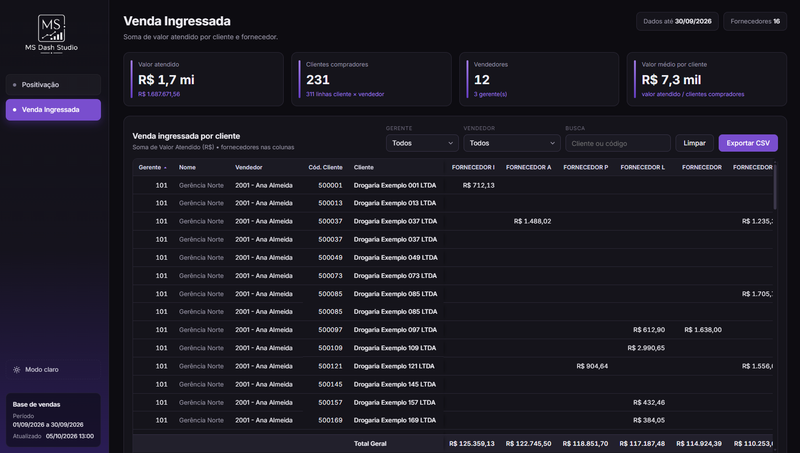
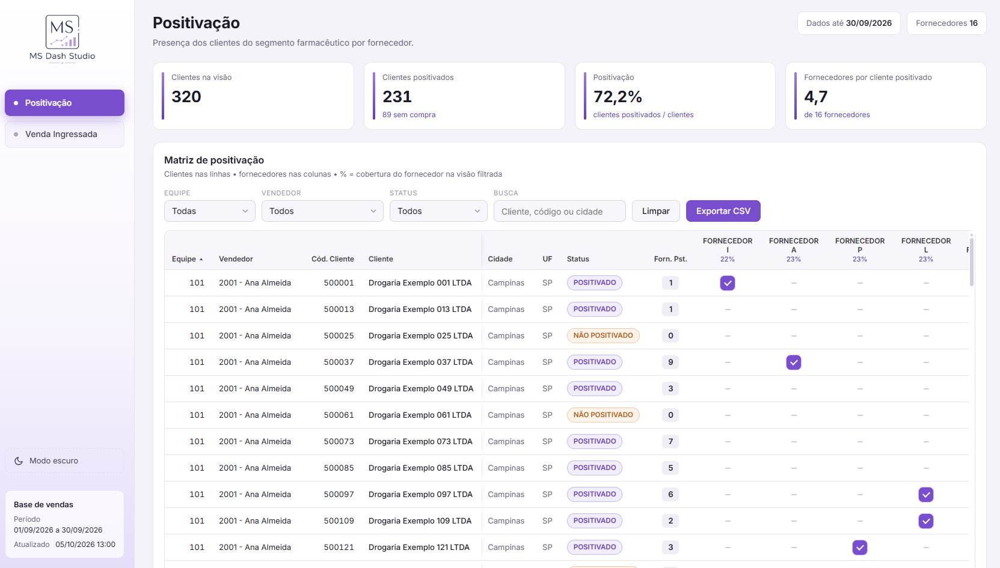

# 💊 Dashboard de Positivação — Varejo Farma

Dashboard web interativo desenvolvido para simular o acompanhamento de **positivação de clientes, cobertura por fornecedor e vendas ingressadas** em uma operação do varejo farmacêutico.

> **Projeto demonstrativo:** todos os clientes, vendedores, gestores, fornecedores, códigos e valores utilizados são **100% fictícios**. Nenhuma informação corporativa real está presente neste repositório.

---

## 🖥️ Preview

### 🌙 Modo escuro



### ☀️ Modo claro



---

## 💡 Sobre o projeto

O projeto foi desenvolvido com o objetivo de transformar dados comerciais em uma interface web de consulta simples e interativa.

A aplicação permite acompanhar a positivação da carteira de clientes, analisar a cobertura dos fornecedores e visualizar vendas ingressadas por cliente, equipe e vendedor.

A versão pública funciona diretamente no navegador, sem necessidade de backend ou instalação de dependências.

---

## ⚙️ Funcionalidades

- Filtros por equipe, vendedor, status e busca de clientes
- Matriz de positivação por cliente e fornecedor
- Indicadores de clientes positivados e cobertura
- Visão de vendas ingressadas por cliente
- Totais e rankings por fornecedor
- Ordenação de colunas
- Paginação de resultados
- Exportação da visão filtrada para CSV
- Atualização dinâmica das informações conforme os filtros
- Alternância entre tema claro e escuro

---

## 🛠️ Tecnologias utilizadas

- **HTML5** — estrutura da aplicação
- **CSS3** — layout, responsividade e temas
- **JavaScript** — filtros, cálculos, interações e exportação
- **Git & GitHub** — versionamento e publicação do projeto
- **GitHub Pages** — hospedagem estática da aplicação

---

## 📂 Dados

A versão pública utiliza uma **base de dados sintética**, criada exclusivamente para este projeto de portfólio.

A base simula:

- clientes do varejo farmacêutico;
- equipes comerciais;
- vendedores e gestores;
- cidades;
- fornecedores fictícios;
- indicadores de positivação;
- valores de vendas ingressadas.

Essa abordagem permite demonstrar as funcionalidades da aplicação sem expor dados reais ou confidenciais.

---

## 🤖 Processo de desenvolvimento

O projeto faz parte dos meus estudos e da minha evolução em **desenvolvimento de software aplicado a dados**, aproveitando minha experiência profissional com indicadores, automações e análise de informações comerciais.

Ferramentas de Inteligência Artificial foram utilizadas como apoio em etapas de prototipação, desenvolvimento, revisão e preparação da versão demonstrativa.

---

## 🚀 Executar localmente

Clone o repositório:

```bash
git clone https://github.com/Marianasantos-dev/farma-positivacao-dashboard.git
```

Depois, abra o arquivo:

```text
index.html
```

em qualquer navegador moderno.

Não é necessário instalar dependências ou configurar um servidor.

---

## 📁 Estrutura do projeto

```text
farma-positivacao-dashboard/
├── index.html
├── README.md
├── Dashboard-preview.png
└── Dashboard-preview-light.png
```

A aplicação é autossuficiente: a base demonstrativa e os recursos necessários para o funcionamento do dashboard estão incorporados ao `index.html`.

---

## 👩‍💻 Autora

**Mariana Santos**

Em formação na área de desenvolvimento de software, com experiência profissional em dados, automações e construção de soluções para apoio à tomada de decisão.

[LinkedIn](https://www.linkedin.com/in/mariana-santos-a712822b8) • [GitHub](https://github.com/Marianasantos-dev)
